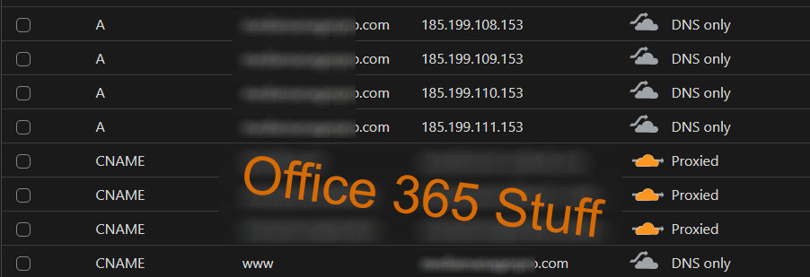

I help admin a group of sites for a local charity, and for some stupid reason, the web host charges for SSL certificates.

Anywho, redirecting the nameservers from the website to let cloudflare do its thing (and use its functons) gives it a free SSL certificate, but, I had one more issue, github pages.

Using the documentation that I found a little hard to understand and some other research, I ended up on using these 4 DNS record edits:

{ width="90%" }

I'm still not sure how it works but still, plus disabling the proxy feature for the records I think were a important part of the whole thing, but no idea.

But most importantly, this also enables the SSL feature that github uses too. And with the Cloudflare SSL settings left on auto (which scans the domain to make sure its ok) has managed to get it all to work, finally!

!!! note

    DNS and other web nonsense takes time for it to all process and cache properly, if setting the DNS records isnt changing, then just wait 30 mins or so and try again :fontawesome-regular-face-grin-beam:

Good luck!
